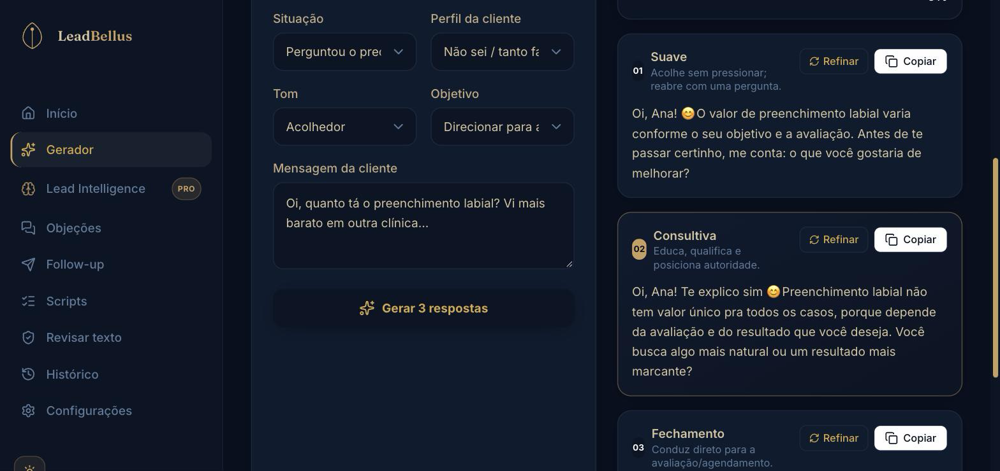

# LeadBellus

**AI-assisted WhatsApp sales replies for Brazilian aesthetic clinics** — turns a
client's message ("how much is Botox?", "that's expensive", silence after a quote)
into three ready-to-send replies in the clinic's own tone, with compliance
guardrails, usage-based paywall and Stripe subscriptions. Live, billing real
customers, built and operated end-to-end by one developer.

> Product UI and copy are in Brazilian Portuguese (the target market). Code,
> comments and this README are mixed EN/PT-BR.

**Live:** https://www.leadbellus.com.br

---

## Tech stack

| Layer | What is used |
| --- | --- |
| Framework | **Next.js 15** (App Router, route groups, server routes) · **React 19** · **TypeScript** (strict) |
| Styling / UI | **Tailwind CSS 3.4**, custom navy/gold design system, `framer-motion`, `lucide-react`, `recharts` |
| Auth | **Clerk** (public sign-in/sign-up, pt-BR localisation) bridged to **Firebase Auth** via server-minted custom tokens so Firestore security rules and billing keep working |
| Data | **Cloud Firestore** (per-user rules, compound indexes) · **Firebase Admin SDK** for webhook writes · **Supabase/Postgres** as an additive analytics mirror |
| AI | **OpenAI** (`gpt-4o-mini`) → **Anthropic Claude** (`claude-haiku-4-5`, prompt caching) → **Google Gemini** (`gemini-2.5-flash`) provider fallback chain, server-side only, with timeout/retry and a post-generation compliance denylist |
| Payments | **Stripe Checkout** (subscription mode, promo codes, annual upsell), **Stripe Billing Portal**, signed **webhooks** reconciled into Firestore with idempotency (`stripe_events`) and guest-checkout linking by e-mail |
| WhatsApp | **Z-API** (WhatsApp Business gateway): outbound send, inbound webhook, auto-reply for paying clinics, per-clinic number binding |
| Growth / analytics | **GA4** (client + Measurement Protocol server events: `begin_checkout`, `purchase`), Meta Pixel, Meta Graph API auto-posting (FB/IG), Zapier lead intake, campaign landing pages (`/campanha/[slug]`) |
| Security | Origin/CORS checks, in-memory rate limiting per route, body-size limits, `Cache-Control: no-store` JSON helpers, Firestore rules that keep `billing` server-only |
| Infra | **Vercel** (production) · Dockerfile + Cloud Build config kept from an earlier deployment path (not in use) · Firebase emulators for local dev · GitHub Actions (Firestore rules/contract verification) |
| Testing | **Vitest** — 35 files / 398 tests over prompts, guardrails, API security, billing, webhooks, config flags and data catalogues (all network mocked, no keys needed) |

## Key features

- **3-variant reply generator** — every client message becomes *Suave / Consultiva / Fechamento* replies, adapted to the clinic's "DNA" (procedures, tone, formality, how they address clients, preferred CTA).
- **Compliance guardrails for aesthetics** — the prompt forbids guaranteed results, diagnoses and fixed prices; a denylist post-check flags violations with severity and reason (`/api/compliance`, `/compliance` page).
- **Objection library, follow-ups and sales scripts** — curated PT-BR playbooks for "achou caro", ghosting, "vou pensar", plus AI-generated follow-up sequences.
- **Lead Intelligence** — intent, sentiment and a 0-100 priority score per conversation, surfaced in the generator and in a dedicated dashboard.
- **WhatsApp Business integration (Z-API)** — inbound webhook stores messages in an inbox (`/conversas`), auto-replies for clinics with an active plan, one-click reply from the app, idempotent handling of provider redeliveries.
- **Stripe subscription flow** — 3 plans (Start R$97 / Pro R$197 / Premium R$347), monthly + annual prices, guest checkout straight from the landing page, webhook → Firestore activation, billing portal for card/cancel, "pending billing" linked to the account on first login.
- **Usage-based paywall** — 5 free generations per account enforced atomically in a Firestore transaction (no race between concurrent requests), unlimited for paying plans.
- **Zero-config demo mode** — with no env vars the whole app runs: login skipped, data in `localStorage`, AI mocked. Real integrations switch on feature-by-feature as keys are provided (`lib/config.ts`).
- **Clerk → Firebase session bridge** — Clerk owns the public auth UX; a server route mints Firebase custom tokens so Firestore rules, checkout and quotas still key off the Firebase uid.
- **Conversion funnel** — 3-step onboarding (clinic DNA → "your reply vs. a generic one" → plans), campaign landing pages, waitlist for unreleased plans, GA4 + server-side purchase events, ops alerts via WhatsApp.
- **Operational endpoints** — `/api/health` and `/api/config` report which capabilities are live (AI providers, Stripe, Clerk, Firebase Admin, Z-API) for deploy verification.

## Live demo

- **Production:** https://www.leadbellus.com.br (Stripe is in live mode — the free tier lets you try the generator on the landing page and after sign-up without a card).
- **Local demo mode:** `npm install && npm run dev` with **no** `.env.local` → open http://localhost:3000/dashboard. Login is skipped and AI replies are mocked, so every screen is clickable offline.

## Screenshots

| | |
| --- | --- |
| **Landing — hero + WhatsApp demo** | **Generator — 3 reply variants** |
|  |  |
| **Onboarding — generic reply vs. the clinic's reply** | **Dashboard** |
|  |  |

## Setup

```bash
git clone https://github.com/prinny2/leadvitta-app && cd leadvitta-app
npm install            # Node 20+
npm run dev            # http://localhost:3000 — demo mode, no keys needed
npm test               # Vitest, 398 tests, fully mocked
```

To enable real integrations copy `.env.local.example` to `.env.local` and fill
the groups you need (each one switches on independently):
`NEXT_PUBLIC_CLERK_*`/`CLERK_SECRET_KEY` (auth) · `NEXT_PUBLIC_FIREBASE_*` +
Firebase Admin credentials (data, quotas, webhooks) · `OPENAI_API_KEY` /
`ANTHROPIC_API_KEY` / `GEMINI_API_KEY` (AI) · `STRIPE_*` (billing) · `ZAPI_*`
(WhatsApp).

Useful checks after a deploy:

```bash
curl https://<host>/api/health   # which integrations are live
curl https://<host>/api/config   # feature flags exposed to the client
```

### Repository map

```
app/(marketing)   landing, /onboarding funnel, /campanha/[slug]
app/(auth)        /login, /signup (Clerk)
app/(app)         dashboard, gerador, conversas, lead-intelligence, objecoes,
                  follow-up, scripts, historico, compliance, configuracoes
app/api           generate, follow-up, lead-intelligence, compliance,
                  stripe/{checkout,portal,webhook}, billing/reconcile,
                  whatsapp/webhook, clerk/webhook, auth/firebase-token, …
lib/ai            provider chain, prompts + compliance denylist, mock
lib/stripe        Stripe client, billing sync, price allowlist
lib/              store (Firestore ⇄ localStorage), api-security, usage-limit,
                  whatsapp-zapi, ops-notify, config flags
data/             PT-BR catalogues: procedures, objections, follow-ups, scripts
tests/            Vitest suites mirroring lib/, data/ and app/api/
```

The app is a **modular monolith**: one build that can run as the full site
(`SERVICE_ROLE=web`, production) or as separate `ai` / `billing` / `whatsapp` /
`growth` services — see `services.yaml`, `docs/architecture/services.md` and
`docker-compose.yml`.

Architecture notes for contributors and AI agents live in `CLAUDE.md`; the
Stripe/Vercel/Z-API runbook is in `docs/ops/`, and `docs/nlp-prototype.ipynb`
is the zero-shot intent/sentiment experiment that preceded Lead Intelligence.

## License

Source-available for portfolio and code review. LeadBellus is a live commercial
product; the code is **not** licensed for reuse or redistribution — see `LICENSE`.
